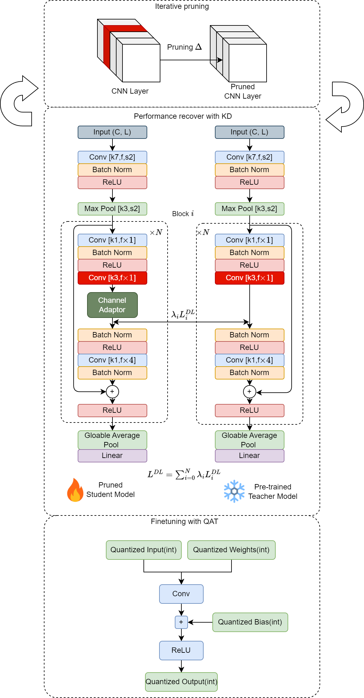
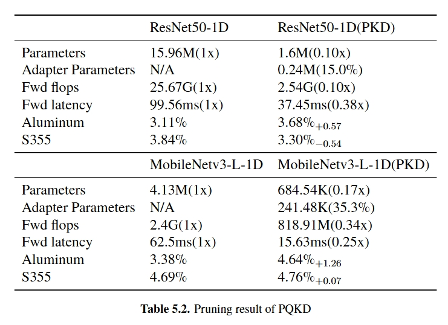

# Pruning-Quantization with Knowledge Distillation(PQKD)
## Introduction
PQKD is a method to compress a model by pruning and quantization with knowledge distillation. Through iterative pruning, performance recovering using knowledge distillation and followed by quantization-aware training (QAT), the PQKD successfully reduces the CNN-based model size by approximately 20 times while maintaining minimal degradation in accuracy. The channel adapters are inserted to match middle layer feature maps, solving the model heterogeneity problem caused by structured pruning. 

## How to use
The PQKD is implemented in PyTorch. First pre-train the model in FP32 with `fp32_pre_training.py`, then run `pruning_with_knowledge_distillation.py` to iteratively pruning with knowledge distillation. Finally, run `QAT_finetune.py` to quantize the model.

## Results
The PQKD achieves 20x compression with minimal accuracy degradation on [PEC datasets][https://www.kaggle.com/datasets/rusuanjun/pec-dataset]. The following table shows the results of ResNet50-1D and MobileNetV3 after pruning with knowledge distillation.

